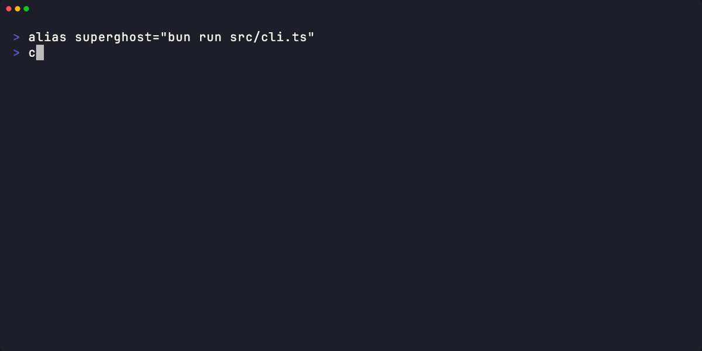

# SuperGhost

Plain English test cases with AI execution and instant cached replay for CI/CD.

Write tests in YAML. An AI agent executes them in a real browser or via API calls. Results are cached step-by-step so re-runs are instant and deterministic -- no flaky tests, no test code to maintain.



## Install

### Zero-install (recommended)

```bash
bunx superghost --config tests.yaml
```

### Homebrew (macOS / Linux)

```bash
brew install lacion/tap/superghost
superghost --config tests.yaml
```

### Global install

```bash
bun install -g superghost
superghost --config tests.yaml
```

### Standalone binary

Download the latest binary for your platform from [GitHub Releases](https://github.com/lacion/superghost/releases).

```bash
chmod +x superghost-darwin-arm64
./superghost-darwin-arm64 --config tests.yaml
```

On first run, the standalone binary automatically installs MCP server dependencies to `~/.superghost/`.

## Quick Start

Create a `tests.yaml` file:

```yaml
baseUrl: https://example.com
model: claude-sonnet-4-6

tests:
  - name: Homepage loads
    case: Navigate to the homepage and verify the page title contains "Example"

  - name: API health check
    case: Send a GET request to /api/health and verify the response status is 200
```

Run it:

```bash
bunx superghost --config tests.yaml
```

## CLI

```
Usage: superghost [options]

Options:
  -c, --config <path>  Path to YAML config file (required)
  --headed             Run browser in headed mode (visible browser window)
  --only <pattern>     Run only tests matching glob pattern
  --no-cache           Bypass cache reads (still writes on success)
  --dry-run            List tests and validate config without executing
  --verbose            Show per-step tool call output during execution
  --output <format>    Output format (json)
  -V, --version        Output the version number
  -h, --help           Display help
```

### Exit Codes

| Code | Meaning |
|------|---------|
| `0`  | All tests passed |
| `1`  | One or more tests failed |
| `2`  | Configuration or runtime error (invalid config, missing API key, unreachable baseUrl) |

### Test Filtering

Use `--only` to run a subset of tests by glob pattern:

```bash
superghost --config tests.yaml --only "Homepage*"
superghost --config tests.yaml --only "*API*"
```

The pattern is matched case-insensitively against test names.

### Dry-Run Mode

`--dry-run` validates your config and lists all tests without executing them. Each test is labeled with its source — `cache` if a cached result exists, or `ai` if it would require an AI call:

```bash
superghost --config tests.yaml --dry-run
```

### JSON Output

`--output json` writes machine-readable JSON to stdout. Human-readable progress still goes to stderr, so you can pipe the JSON output:

```bash
superghost --config tests.yaml --output json > results.json
superghost --config tests.yaml --output json 2>/dev/null | jq .
```

Combines with other flags like `--dry-run` and `--only`.

### Verbose Mode

`--verbose` prints per-step tool call output during execution, useful for debugging test failures.

## Provider Setup

SuperGhost supports four AI providers. Set the appropriate environment variable for your chosen provider.

### Anthropic (default)

```bash
export ANTHROPIC_API_KEY=sk-ant-...
```

```yaml
model: claude-sonnet-4-6
```

### OpenAI

```bash
export OPENAI_API_KEY=sk-...
```

```yaml
model: gpt-4o
modelProvider: openai
```

### Google Gemini

```bash
export GOOGLE_GENERATIVE_AI_API_KEY=...
```

```yaml
model: gemini-2.5-flash
modelProvider: gemini
```

### OpenRouter

```bash
export OPENROUTER_API_KEY=sk-or-...
```

```yaml
model: anthropic/claude-sonnet-4-6
modelProvider: openrouter
```

## Configuration

All fields in `tests.yaml`:

| Field | Type | Default | Description |
|-------|------|---------|-------------|
| `baseUrl` | `string` | — | Base URL for all tests |
| `model` | `string` | `"claude-sonnet-4-6"` | AI model identifier |
| `modelProvider` | `string` | `"anthropic"` | Provider: `anthropic`, `openai`, `gemini`, `openrouter` |
| `browser` | `string` | `"chromium"` | Browser engine: `chromium`, `firefox`, `webkit` |
| `headless` | `boolean` | `true` | Run browser in headless mode |
| `timeout` | `number` | `60000` | Global timeout in ms |
| `maxAttempts` | `number` | `3` | Max retry attempts per test (1–10) |
| `recursionLimit` | `number` | `500` | Max AI reasoning steps |
| `cacheDir` | `string` | `".superghost-cache"` | Directory for cached test steps |
| `context` | `string` | — | Global context passed to every test |
| `tests` | `array` | (required) | Array of test definitions |
| `tests[].name` | `string` | — | Display name for the test |
| `tests[].case` | `string` | (required) | Plain English test instruction |
| `tests[].baseUrl` | `string` | — | Per-test URL override |
| `tests[].timeout` | `number` | — | Per-test timeout override |
| `tests[].type` | `string` | `"browser"` | Test type: `browser` or `api` |
| `tests[].context` | `string` | — | Per-test context for the AI agent |

## How It Works

1. **First run:** The AI agent reads your plain English test case and executes it step-by-step in a real browser (via Playwright MCP) or via API calls (via curl MCP). Each step is recorded to a cache file.

2. **Subsequent runs:** Cached steps are replayed directly against the browser/API without calling the AI. This makes re-runs instant and deterministic.

3. **Self-healing:** If a cached step fails during replay (e.g., a selector changed), SuperGhost automatically falls back to the AI agent to re-execute that test. The new steps replace the stale cache.

## Example App (E2E)

The `e2e/` directory contains a fullstack Task Manager app that validates SuperGhost end-to-end and serves as a reference for writing test configs.

```bash
# Start the example app
bun run e2e:app
# Open http://localhost:3777

# Run smoke tests (2 tests — requires an AI API key)
bun run e2e:smoke

# Run browser UI tests (7 tests)
bun run e2e:browser

# Run API endpoint tests (7 tests)
bun run e2e:api

# Run all 16 tests
bun run e2e:all
```

The test runner exits gracefully when no API key is configured, making it safe for CI environments. See [`e2e/README.md`](e2e/README.md) for details.

## Standalone Binary

When running as a standalone compiled binary (downloaded from GitHub Releases), SuperGhost cannot use `bunx` to spawn MCP server packages. Instead:

- On first run, MCP dependencies (`@playwright/mcp`, `@calibress/curl-mcp`) are automatically installed to `~/.superghost/`
- Subsequent runs skip the install step
- You must have a Playwright-compatible browser installed on your system (Chromium, Firefox, or WebKit)
- SuperGhost does **not** auto-install browser binaries -- if Playwright cannot find a browser, it will display its own error message with install instructions
